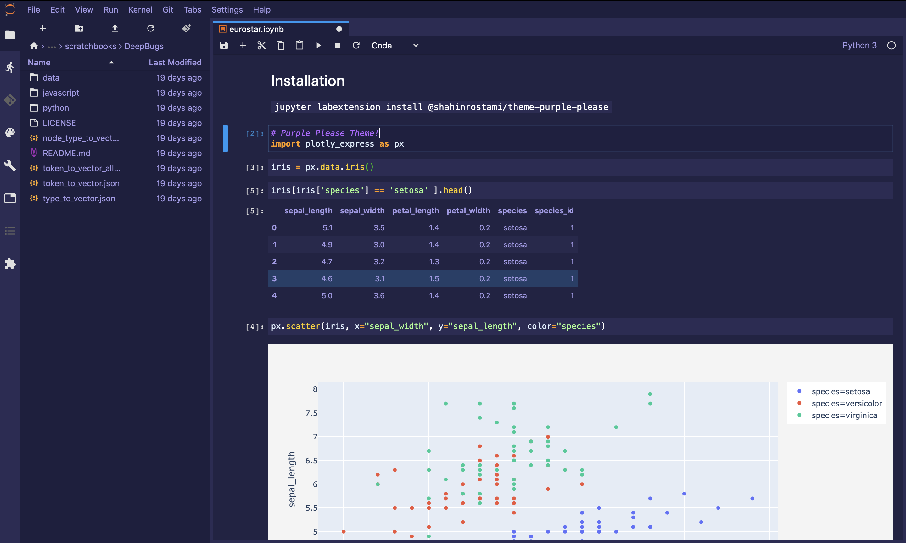

# @shahinrostami/theme-purple-please

A JupyterLab theme extension which provides the Purple Please theme, inspired by the Shades of Purple theme from VSCode.



## Prerequisites

* JupyterLab

## Installation

```bash
jupyter labextension install @shahinrostami/theme-purple-please
```

## Development

For a development install (requires npm version 4 or later), do the following in the repository directory:

```bash
npm install
jupyter labextension link .
```

To rebuild the package and the JupyterLab app:

```bash
npm run build
jupyter lab build
```
